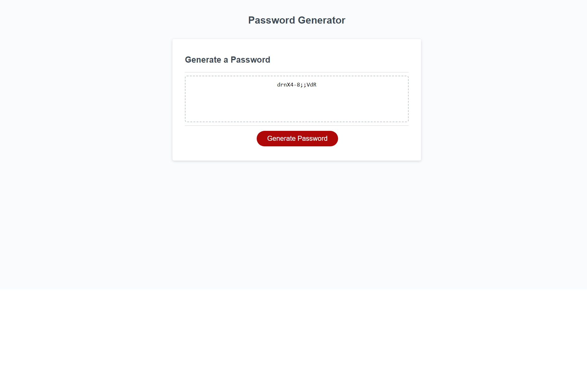

# Password Generator

## Description

This challenge is a javascript challenge. Website must generate a password based on
user selected criteria.

## Technology Stack


## User Story

```md
AS AN employee with access to sensitive data
I WANT to randomly generate a password that meets certain criteria
SO THAT I can create a strong password that provides greater security
```

## Acceptance Criteria

```md
GIVEN I need a new, secure password
WHEN I click the button to generate a password
THEN I am presented with a series of prompts for password criteria
WHEN prompted for password criteria
THEN I select which criteria to include in the password
WHEN prompted for the length of the password
THEN I choose a length of at least 8 characters and no more than 128 characters
WHEN asked for character types to include in the password
THEN I confirm whether or not to include lowercase, uppercase, numeric, and/or special characters
WHEN I answer each prompt
THEN my input should be validated and at least one character type should be selected
WHEN all prompts are answered
THEN a password is generated that matches the selected criteria
WHEN the password is generated
THEN the password is either displayed in an alert or written to the page
```

## Screenshot



## Deployed page

[View Published Page](https://iam3dski.github.io/password-generator/) 

## License

[MIT](https://choosealicense.com/licenses/mit/)

## Starter Code

[Starter Code](https://github.com/coding-boot-camp/friendly-parakeet)
